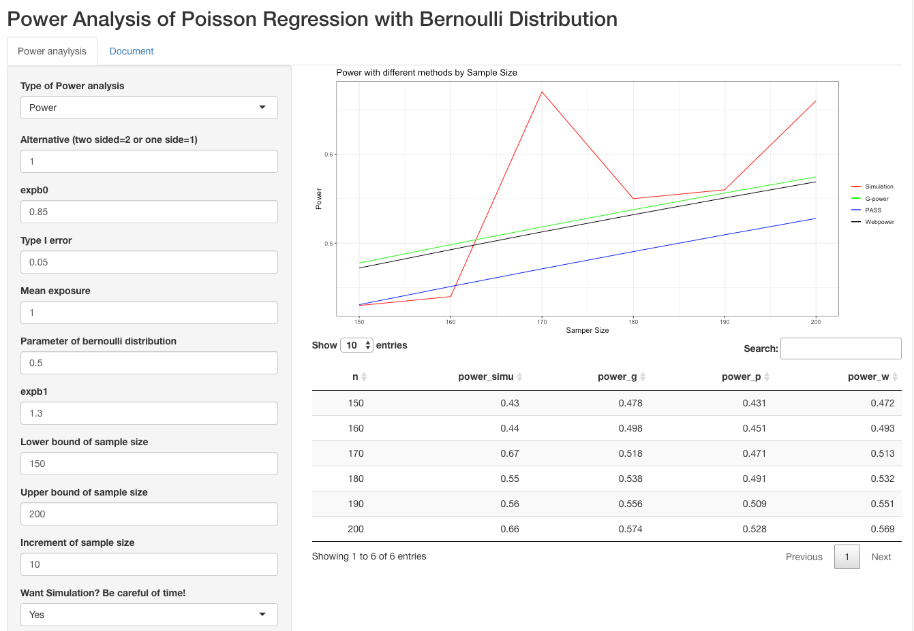
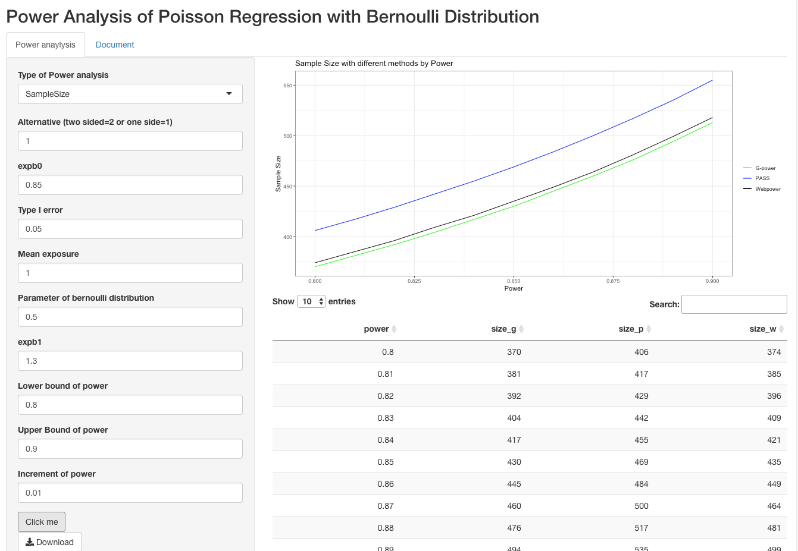
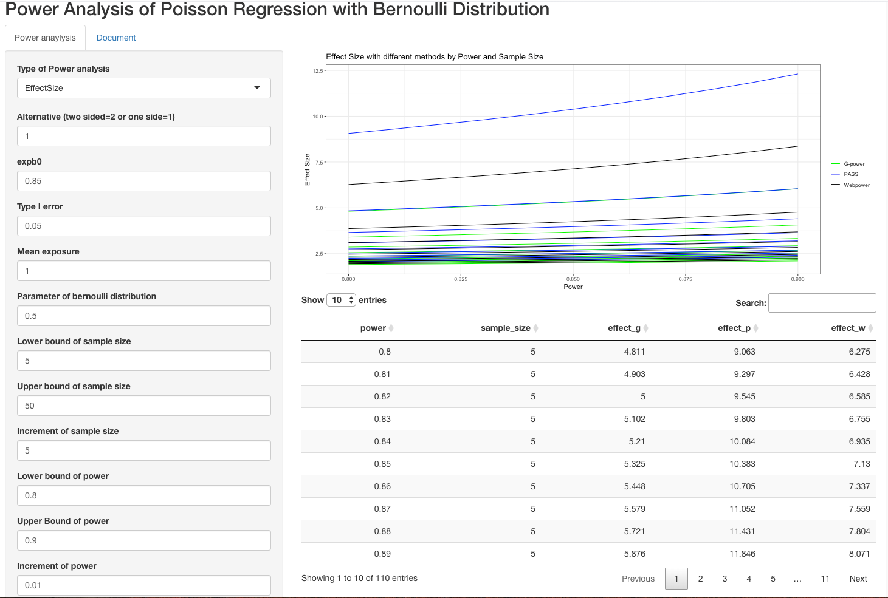

```{r setup, include=FALSE}
knitr::opts_chunk$set(echo = TRUE)
library(tidyverse)
library(janitor)
library(readxl)
```

# Aim of study

Power analysis is essential in the design of clinical or experimental study. G-power, PASS, and WebPower from R package are three main software for computing power, sample size, and effect size. In this study, we focus on the power analysis of Poisson Regression with Bernoulli Distribution. We find a slight difference for Poisson regression among the results from those software. We plan to discuss and find the reason for the difference and give some suggestions about power analysis for Poisson regression. We hope this study could help to understand these software's pros and cons and be careful when selecting software to calculate power and sample size. 

# Study definitions

In a simple Poisson regression model with only one covariate of Bernoulli distribution, the outcome variable Y is a discrete count variable, which assumes to follow Poisson distribution. The probability of Y with parameter of Poisson distribution "$\lambda$" and during the exposure time "t" is,    

$$P(Y=y|\lambda,t)=\frac{e^{-\lambda t}(\lambda t)^{y}}{y!}$$
The log rate of Poisson regression model is, 

$$log(\lambda)=b_0+b_1X$$

The definitions of this study as below:

Alternative: two-sided or one-side
$e^{b_0}$: the mean event rate assumed under $H_0$  
$e^{b_1}$: the relative increase of the event rate over the mean rate assumed under $H_0$  
Mean exposure: denote by t, the time unit during which the events are counted  
Parameter of Bernoulli distribution: denote by p, the probability when X=1  
Type I error: denote by $\alpha$, the probability that the test falsely rejects the null hypothesis  
Sample size: denote by N, the smallest sample size for designed power
Power: the probability that the test correctly rejects the null hypothesis
Effect size: the ratio of $\lambda$ under null hypothesis to alternative hypothesis.


# Methods for different software 

Based on the large sample approximation procedure for logistic regression by Whittemore(1982), Signorini(1991) gives a general approach to calculate power for Poisson regression with one covariate. This method considers $b_1$ as the parameter of interest, and uses Wald test $Z=\frac{\hat b_1}{Var(\hat b_1)}$. For a two-sided hypothesis, $H_0: b_1=0 \  vs. H_1: b_1\neq0$. Given the significant level of $\alpha$, power of $1-\beta$, assuming N is large enough to apply the asymptotic results, the formula for power analysis is,

$$N=\frac{\bigg(Z_{1-\alpha/2}\sqrt{V(b_1|H_0)}+Z_{1-\beta}\sqrt{V(b_1|H_1)} \bigg)^2}{te^{b_0}b_1^2}(1)$$
For Bernoulli distribution, the variance under the null hypothesis is,  
$$V(b_1|H_0)=\frac{1}{p(1-p)}$$
The variance under the alternative hypothesis is,  
$$V(\hat b_1|H_1)=\frac{1}{1-p}+\frac{1}{pe^{b_1}}$$

PASS uses this method. From the formula, we could derive each type of power analysis with R if we inputs other parameters. 

Unlike formula (1) uses the variance at the null hypothesis $b_1=0$, Demidenko(2007) gives a general formula for logistic regression derived under the assumption that the variance is evaluated at the MLE. Demidenko states that Whittemore(1982) does not entirely reflect the way Wald tests are used in practice. Specifically, the formula from Signorini(1991) is not accurate since the null hypothesis is the unknown parameter takes value of 0, assuming $b_1=0$. Demidenko shows the test statistics is $Z=\frac{\sqrt{n}(\hat b_1-0)}{\sqrt{\hat V}}$, $V$ is the asymptotic variance of $\sqrt{n}\hat b_1$ under the alternative hypothesis $H_1: b_1 \neq0$. So the formula for Poisson regression is,

$$N=\frac{\big(Z_{1-\alpha/2}+Z_{1-\beta}\big)^2V}{tb_1^2}(2)$$
For Bernoulli distribution, 
$$V=\frac{1}{(1-p)e^{b_0}}+\frac{1}{pe^{b_0}e^{b_1}}$$

Webpower from R package use this method with function wp.Poisson for calculate power and sample size for Poisson regression. In this study, we expand the range of this function and could calculate effect size with the same statistic approximation.   

Moreover, based on method of Demidenko(2007), G-power adds a variance correction to compensate the variance distortions from skewed X distribution.   
With variance correction, instead of using null hypothesis $b_1=0$, we use the null hypothesis with $b_1=b^*$. The formula for Poisson regression is, 

$$N=\frac{\bigg(Z_{1-\alpha/2}\sqrt{V(\hat 
b_1|H_1)}+Z_{1-\beta}\sqrt{V(\hat b_1|H_0^*)} \bigg)^2}{tb_1^2}(3)$$
For Bernoulli distribution,
$$b^*=log(\int f(x)e^{b_0+b_1x}dx)=log(pe^{b_0}e^{b_1}+(1-p)e^{b_0})$$

$$V(\hat b_1|H_0^*)=\frac{1}{p(1-p)e^{b^*}}$$
$$var(\hat b_1|H_1)=\frac{1}{(1-p)e^{b_0}}+\frac{1}{pe^{b_1}e^{b_0}}$$

Besides the methods above, we also develop Monte Carlo simulation to estimate power of Poisson regression. Based on generating random data with specified sample size and parameter of distribution, we use R command "glm" on those randomly generated data and obtain the p-value for the test. We reject the null hypothesis when the p-value is less than our significance level. We repeat these steps for n times. Our estimate of power is the proportion of times that the null hypothesis is rejected. 

# Example

Signorini(1991) shows an example in the paper, which reproduces in the manual of G-power and PASS. We also use it to validate our study. In this example, $e^{b_1}$=1.3, $e^{b_0}$=0.85, t(mean exposure)=1, p(the parameter for binomial distribution)=0.5. One-side test with $\alpha$=0.05. Sample size for power =0.8,0.9,0.95 are calculated to be 406,555,697. In this study, we expand the range of parameters for power analysis.  

For power calculation, the sample size is 350 to 700, and the increment is 50. We use the power calculated by simulation as a gold standard measure, with 6,000 simulation times. Table 1 shows the results by simulation and different software. n denotes the sample size. Power_simu, power_g, power_p, and power_w denote power calculated by simulation, G-power, PASS, and WebPower. 

Power from G-power and WebPower are very close to the simulation, and power from PASS has the same trend but is not close to the simulation (see table1, plot1). When the power difference is less than 0, the difference between G-power and simulation is the smallest, with mean of 0.000719, sd of 0.00302. When the power difference is greater than 0, the difference between WebPower and simulation is the smallest, with mean of -0.00106, sd of 0.00299. The power difference between PASS and simulation is the biggest, with mean of -0.0209, sd of 0.00887.  As sample size increases, the trend of the difference power between G-power and simulation is the same between WebPower and simulation, and no consistent increase or decrease. As sample size increases, the difference between PASS and simulation has a decreasing trend (see table1, plot2). The difference power between G-power and WebPower is minimal. As the sample size increases, the difference between the three software decreases. (see plot3) 

From this example, G-power and WebPower give almost the same accurate power. PASS gives the most inaccurate but it becomes more accurate as sample size increases. As discussed in the method part, G-power uses analytic approximation with variance correction, improving the accuracy of power. PASS bases on the variance under the null hypothesis $b_1=0$, which is not accurate.

```{r echo=TRUE, message=FALSE}
tablepd<-read_csv("Power.csv")%>%
  mutate(diff_g_simu=power_g-power_simu,
         diff_p_simu=power_p-power_simu,
         diff_w_simu=power_w-power_simu,
         diff_g_p=power_g-power_p,
         diff_g_w=power_g-power_w,
         diff_p_w=power_p-power_w)
tablepdr<-round(tablepd,digits = 3)
tablepdr%>%gt::gt()%>% gt::tab_header(
    title = "Table1 Power with simulation and different software")
```

```{r echo=TRUE, message=FALSE}
skimr::skim(tablepd)
```


```{r echo=TRUE, message=FALSE}
ggplot(data=tablepdr,aes(x=n))+
  geom_line(aes(y=power_simu,color="Simulation"))+
  geom_line(aes(y=power_g,color="G-power"))+
  geom_line(aes(y=power_p,color="PASS"))+  
  geom_line(aes(y=power_w,color="WebPower"))+ 
  scale_colour_manual("", 
                      breaks = c("Simulation", "G-power", "PASS", "WebPower"),
                      values = c("red", "green", "blue","black"))+
  ggtitle("Plot1 Power plot by Sample Size")+
  labs(x="Samper Size", y="Power")+theme_bw()
```

```{r echo=TRUE, message=FALSE}
ggplot(data=tablepdr,aes(x=n))+
  geom_line(aes(y=diff_g_simu,color="Difference of G-power and Simulation"))+
  geom_line(aes(y=diff_p_simu,color="Difference of PASS and Simulation"))+
  geom_line(aes(y=diff_w_simu,color="Difference of WebPower and Simulation"))+
  scale_colour_manual("", 
                      breaks = c("Difference of G-power and Simulation",
                                 "Difference of PASS and Simulation",
                                 "Difference of WebPower and Simulation"
                                 ),
                      values = c("green", "blue","black"))+
  ggtitle("Plot2 Power Difference compared with simulation by Sample Size")+
  labs(x="Samper Size", y="Power Difference")+
  geom_hline(yintercept=0, linetype="dashed", color = "red")+
  theme_bw()
```

```{r echo=TRUE, message=FALSE}
ggplot(data=tablepdr,aes(x=n))+
  geom_line(aes(y=diff_g_p,color="Difference of G-Power and PASS"))+
  geom_line(aes(y=diff_g_w,color="Difference of G-Power and WebPower"))+
  geom_line(aes(y=diff_p_w,color="Difference of PASS and WebPower"))+
  scale_colour_manual("", 
                      breaks = c("Difference of G-Power and PASS",
                                 "Difference of G-Power and WebPower",
                                 "Difference of PASS and WebPower"
                                 ),
                      values = c("black","blue","purple"))+
  ggtitle("Plot3 Power Difference among three software by Sample Size")+
  labs(x="Samper Size", y="Power Difference")+
  geom_hline(yintercept=0, linetype="dashed", color = "red")+
  theme_bw()
```

For sample size calculation, the power is 0.8 to 0.95, and the increment is 0.01.Table 2 shows the results by different software. Size_g, size_p, size_w denote sample size calculated by G-power, PASS and WebPower.

Sample Size from G-power is the smallest, and very close to the result from WebPower. PASS gives the biggest sample size(see table2, plot4). The sample size difference between G-power and WebPower is the smallest, with mean of -3.5, sd of 1.15. The sample size difference between G-power and PASS is the biggest, with mean of -36.69, sd of 4.38. The mean and sd of the power difference between PASS and WebPower are 36.19 and 3.29. As power increases, the difference between the three software increases. (see table2, plot5)

We select one row to use simulation for calculating power. In the first row of table2, the sample size from different software is 372, 406, 374, the power calculated with simulation 6,000 times is 0.804,0.826,0.806. In this specific one, G-power gives the most accurate estimate of sample size, and the PASS is the most inaccurate.  


```{r echo=TRUE, message=FALSE}
tables<-read_csv("SampleSize.csv")
tablesd<-tables%>%mutate(diff_g_p=size_g-size_p,
                        diff_g_w=size_g-size_w,
                        diff_p_w=size_p-size_w)

tablesd%>%gt::gt()%>%gt::tab_header(
    title = "Table2 Sample Size by different software")
```

```{r echo=TRUE, message=FALSE}
skimr::skim(tablesd)
```

```{r echo=TRUE, message=FALSE}
ggplot(data=tablesd,aes(x=power))+
                    geom_line(aes(y=size_g,color="G-power"),size=0.5)+
                    geom_line(aes(y=size_p,color="PASS"),size=0.5)+  
                    geom_line(aes(y=size_w,color="Webpower"),size=0.5)+ 
                    scale_colour_manual("", 
                                        breaks = c("G-power", "PASS", "Webpower"),
                                        values = c("green", "blue","black"))+
                    ggtitle("Plot4 Sample Size by Power")+
                    labs(x="Power", y="Sample Size") +theme_bw()
```

```{r echo=TRUE, message=FALSE}
ggplot(data=tablesd,aes(x=power))+
  geom_line(aes(y=diff_g_p,color="Difference of G-Power and PASS"))+
  geom_line(aes(y=diff_g_w,color="Difference of G-Power and WebPower"))+
  geom_line(aes(y=diff_p_w,color="Difference of PASS and WebPower"))+
  scale_colour_manual("", 
                      breaks = c("Difference of G-Power and PASS",
                                 "Difference of G-Power and WebPower",
                                 "Difference of PASS and WebPower"
                                 ),
                      values = c("black","blue","purple"))+
  ggtitle("Plot5 Sample Size Difference among three software by Power")+
  labs(x="Power", y="Sample Size Difference")+
  geom_hline(yintercept=0, linetype="dashed", color = "red")+
  theme_bw()
```

For effect size calculation, the sample size is 450 to 700, the power is 0.8 to 0.95, the increment of sample size is 50, and of power is 0.05.Table 3 shows the results by different software. Effect_g, Effect_p, Effect_w denote effect size calculated by G-power, PASS and WebPower.

Effect Size from G-power is the smallest, and very close to the result from WebPower($\pm0.001)$. PASS gives the biggest effect size(see table3, plot6). The effect size difference between G-power and WebPower is the smallest. The effect size difference between G-power and PASS is the biggest. As power increases and keep sample size constant, the effect size difference between three software increases (see table3, plot7). As sample size increases and keep power constant, the effect size difference between three software decreases (see table2, plot8). 
We select one row to use simulation for calculating power. In the first row of table3, the sample size is 450, the effect size from different software is 1.271,1.283,1.272, the power with simulation 6,000 times is 0.797,0.824,0.799. In this specific one, WebPower gives the most accurate estimate of effect size, and the PASS is the most inaccurate. 

```{r echo=TRUE, message=FALSE}
tablef<-read_csv("EffectSize.csv")
tablefd<-tablef%>%mutate(diff_g_p=effect_g-effect_p,
                        diff_g_w=effect_g-effect_w,
                        diff_p_w=effect_p-effect_w)
tablefdr<-round(tablefd,digits = 3)

tablefdr%>%gt::gt()%>%gt::tab_header(
    title = "Table3 Effect Size by different software")
```

```{r echo=TRUE, message=FALSE}
skimr::skim(tablefdr)
```

```{r echo=TRUE, message=FALSE}
ggplot(data=tablefdr,aes(x=power,group=sample_size))+
                        geom_line(aes(y=effect_g,color="G-power"),size=0.5)+
                        geom_line(aes(y=effect_p,color="PASS"),size=0.5)+  
                        geom_line(aes(y=effect_w,color="Webpower"),size=0.5)+ 
                        scale_colour_manual("", 
                                            breaks = c("G-power", "PASS", "Webpower"),
                                            values = c("green", "blue","black"))+
                        ggtitle("Plot6 Effect Size by Power and Sample Size")+
                        labs(x="Power", y="Effect Size") +facet_grid(~sample_size)+theme_bw()+theme(axis.text.x = element_text(angle = 90, vjust = 0.5, hjust=1))
```

```{r echo=TRUE, message=FALSE}
ggplot(data=tablefdr,aes(x=power,group=sample_size))+
  geom_line(aes(y=diff_g_p,color="Difference of G-Power and PASS"))+
  geom_line(aes(y=diff_g_w,color="Difference of G-Power and WebPower"))+
  geom_line(aes(y=diff_p_w,color="Difference of PASS and WebPower"))+
  scale_colour_manual("", 
                      breaks = c("Difference of G-Power and PASS",
                                 "Difference of G-Power and WebPower",
                                 "Difference of PASS and WebPower"
                                 ),
                      values = c("black","blue","purple"))+
  ggtitle("Plot7 Effect Size difference among three software with Sample Size by Power")+
  labs(x="Power", y="Effect Size Difference")+
  facet_grid(~sample_size)+
  theme_bw()+theme(axis.text.x = element_text(angle = 90, vjust = 0.5, hjust=1))+
  geom_hline(yintercept=0, linetype="dashed", color = "red")
```

```{r echo=TRUE, message=FALSE}
ggplot(data=tablefdr,aes(x=sample_size,group=power))+
  geom_line(aes(y=diff_g_p,color="Difference of G-Power and PASS"))+
  geom_line(aes(y=diff_g_w,color="Difference of G-Power and WebPower"))+
  geom_line(aes(y=diff_p_w,color="Difference of PASS and WebPower"))+
  scale_colour_manual("", 
                      breaks = c("Difference of G-Power and PASS",
                                 "Difference of G-Power and WebPower",
                                 "Difference of PASS and WebPower"
                                 ),
                      values = c("black","blue","purple"))+
  ggtitle("Plot8 Effect Size difference among three software with Power by Sample Size")+
  labs(x="Sample Size", y="Effect Size Difference")+
  facet_grid(~power)+
  theme_bw()+theme(axis.text.x = element_text(angle = 90, vjust = 0.5, hjust=1))+
  geom_hline(yintercept=0, linetype="dashed", color = "red")
```

# R and Shiny App

For this study, we use R for programming. We didn't use specific R package for power analysis since it is hard to find an accuracy R package for Poisson regression. Because the code of G-power and PASS is not public, and WebPower can only use for power and sample size calculation. To get the results from simulation and different software, we code by ourselves based on approximation methods they use. 

For calculating effect size, we use uniroot function from R to solve nonlinear equation. For this function, we need to specify a finite interval for effect size. We set the effect size between 0-1000. If effect size exceeds this range, the uniroot may can not get a solution.  

In order to more intuitively show the running results of different software，we use Shinny APP to create an interactive interface for power analysis. The App could display power analysis by different software. With different parameter for each type of power analysis, we could get a table and a plot based on results from different software. Our code is public on Github (https://github.com/jessieliuyan/PSS_Poisson), run it with R code "runGitHub('PSS_Poisson','jessieliuyan', ref="main")".  

This image shows interactive interface for power calculation. We could set the inputs of sample size more flexible by different upper bound, lower bound and increment.    
```{r echo=TRUE, message=FALSE}

```

This image shows interactive interface for sample size calculation. We could set the inputs of power  more flexible by different upper bound, lower bound and increment.     
```{r echo=TRUE, message=FALSE}

```

This image shows interactive interface for effect size calculation. We could set the inputs of power and sample size more flexible by different upper bound, lower bound and increment.     
```{r echo=TRUE, message=FALSE}

```

# Discussion  
In this study, we compare different software results of Poisson Regression with Bernoulli Distribution. We derive the formulas behind these software and implement the simulation method. We found the result from G-power and WebPower is very close, and the accuracy of power analysis is similar. The result from PASS is the most inaccurate and should be used carefully. We create Shiny App to display the results, which could help researchers analyze power when designing the study. 

This study is part of Power and Sample Size project. We only do the power analysis with a simple Poisson regression model with Bernoulli distribution for time limitation. We could explore more after this study. First, we could compare the difference between different distributions. We could consider Normal, Uniform, Exponential, Lognormal, etc. Second, we could consider more covariates and do a power analysis of multiple Poisson regression. Third, considering overdispersion of discrete count outcome, we could do the power analysis with quasi-Poisson regression or a negative binomial regression model. 

# Reference
Whittemore, A. S. (1981). Sample size for logistic regression with small response probabilities. Journal of the 84 American Statistical Association, 76, 27-32.    
Signorini, D. F. (1991). Sample size for Poisson regression.
Biometrika, 78, 446-450.    
Demidenko, E. (2007). Sample size determination for logistic regression revisited. Statistics in Medicine, 26, 3385-3397.  
G* Power 3.1 manual, January 21, 2021.  
R Package 'WebPower' manual, May 18, 2021.  
PASS sample size software, Chapter 870, Poisson Regression.  


